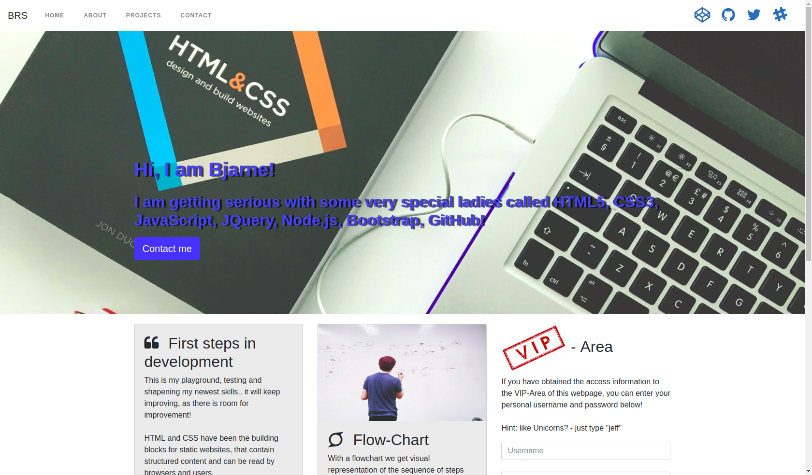

## My Portfolio

This is my very first attempt of building a portfolio-page. :bowtie:

<p align="center"> 

</p>

## See this :poop: out live! 

To see the live version click [here](https://web-developer-js.de) :rocket:


## Project Info

[Bootstrap](https://getbootstrap.com/) is used as a Framework.
 ***Gulp*** as ***Task-Manager***. 
 [FontAweSome](https://fontawesome.com/) is included as a vendor.
 ***SCSS*** is complied as is the ***javascript*** when running gulp. This will update in your browser.

## Local Version

If you have cloned the repository please run:

```
npm start
```

To start the application in development mode when installed run
```
gulp watch
```


